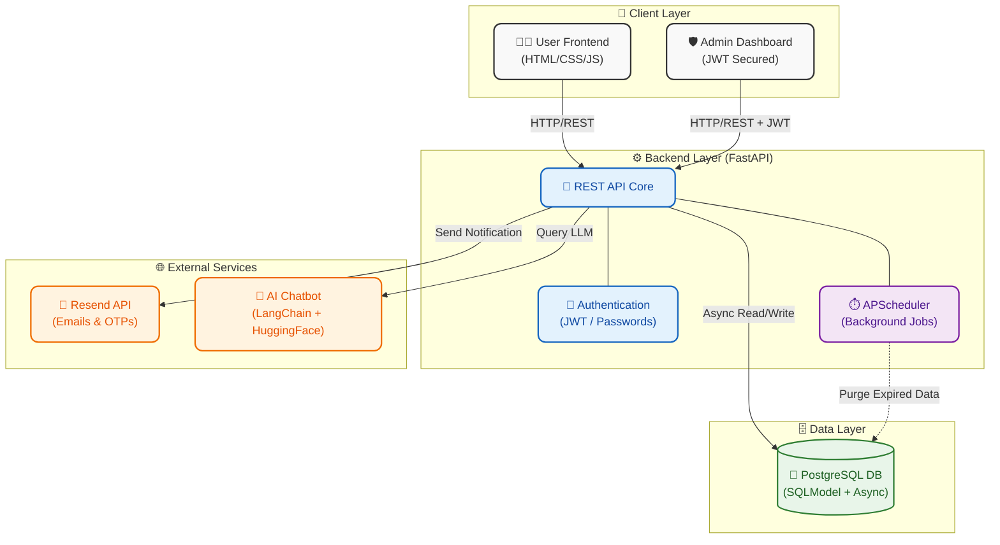

<div align="center">

# 🦷 Dental Clinic Management & Portfolio Platform

*A comprehensive, full-stack digital solution designed to bridge the gap between dental professionals and their patients.*

[](https://www.burmandental.co.in)

</div>

---

## 🧑‍🏫 Complete Demonstration Video [Here](https://youtu.be/orv_wsvrPkk?si=fvgwQ1-IiI2qPTHD)

## 🌟 About The Project

This full-stack Dental Clinic Management Platform bridges the gap between dental professionals and patients. The responsive public site lets patients explore services, check real-time schedules, and view staff profiles. A standout feature is the integrated **AI chatbot**, built with LangChain and HuggingFace, providing instant, intelligent responses to patient inquiries.

A secure admin dashboard empowers clinic staff to effortlessly manage dynamic content, announcements, and patient contacts. Engineered for high performance, the robust backend leverages FastAPI, SQLModel, and asynchronous PostgreSQL. It implements comprehensive JWT authentication, secure OTP-based user registration, and automated email workflows using Resend. Background tasks are efficiently managed via APScheduler to automatically clear expired records.

Blending an intuitive frontend with a cutting-edge Python architecture, this platform delivers a secure, scalable, and engaging digital experience for modern dentistry.

---

## 🚀 Tech Stack

<div align="center">
  
**Frontend**  


**Backend & Database**  


**Security & Utilities**  


**AI & Integrations**  


</div>

---

## 🏗️ System Architecture



The architecture follows a decoupled **Client-Server model**, divided into the following layers:

1. **User Frontend (`/frontend-user`)**: A purely static, highly responsive vanilla HTML/CSS/JS interface designed to run on the client-side, dynamically fetching data via RESTful API endpoints.
2. **Admin Frontend (`/frontend-admin`)**: A secure dashboard for clinic administrators to seamlessly perform CRUD operations on clinic data, utilizing JWT Bearer token-based authentication.
3. **Backend API (`/backend`)**: A robust API built with **FastAPI**. It routes incoming HTTP requests, validates payloads utilizing **Pydantic**, and interacts with the database.
4. **Database Layer**: Leverages asynchronous **PostgreSQL** coupled with **SQLModel** (a wrapper over SQLAlchemy) for highly performant and structured query execution.
5. **Background Workers (`APScheduler`)**: Asynchronous jobs running in the background to automatically clear expired OTPs and outdated announcements.
6. **External Integrations**:
   - **Resend API**: Used for sending OTPs and email notifications.
   - **Langchain & HuggingFace Models**: Integrated for conversational AI via the Chatbot endpoint.

---

## 📂 Detailed Directory Structure

```text
DentalClinic/
├── backend/                              # Core Python API Application
│   ├── requirements.txt                  # Python dependencies
│   ├── app/                              # Application Module
│   │   ├── main.py                       # FastAPI entrypoint & scheduler
│   │   ├── schemas.py                    # Pydantic validation schemas
│   │   ├── core/                         # Configuration and Security
│   │   │   ├── config.py                 # Environment variable loader
│   │   │   ├── db.py                     # Database engine & session maker
│   │   │   ├── auth.py                   # JWT generation and hashing
│   │   │   └── chatbot_config.py         # AI Model Configuration
│   │   ├── models/                       # SQLModel Database Entities
│   │   │   ├── static_tables.py          # Profile, Staff, Admin models
│   │   │   └── dynamic_tables.py         # Announcements, OTP models
│   │   ├── routers/                      # API Endpoints by Feature
│   │   │   ├── announcements.py          
│   │   │   ├── auth.py                   
│   │   │   ├── chatbot.py                
│   │   │   ├── email.py                  
│   │   │   └── ... (other routes)        
│   │   └── services/                     # Business Logic Layer
│   │       └── email_service.py          # Resend Email Integration
│   └── frontend-admin/                   # Admin Dashboard Application
│       ├── index.html                    # Admin login page
│       ├── introduction.html             # Profile management UI
│       ├── js/                           # Admin-specific JavaScript scripts
│       └── css/                          # Admin-specific stylesheets
├── frontend-user/                        # Patient-facing Web Application
│   ├── index.html                        # Main landing page
│   ├── experience.html                   # Doctor's experience page
│   ├── staff.html                        # Staff directory page
│   ├── contact.html                      # Contact us page
│   ├── js/                               # Patient-side JS modules
│   │   ├── main.js                       # Core frontend logic
│   │   └── env.js                        # Environment variables loader
│   ├── css/                              # Patient-side styling
│   └── vercel.json                       # Vercel deployment config
├── Media/                                # Shared Media Assets
│   ├── DevoVid.mp4                       
│   └── MapsVideo.mp4                     
└── Makefile                              # Automation script for setup & run
```

---

## ✨ Core Features

- **Dynamic Data Rendering**: Synchronize real-time clinic schedules, announcements, and doctor profiles.
- **AI Chatbot**: Real-time answering of queries utilizing HuggingFace embeddings via LangChain.
- **Secure Authentication**: Robust JWT implementation with password hashing for Admin access.
- **OTP Verification**: Secure patient registration workflow with timed OTP expiration.
- **Automated Data Maintenance**: APScheduler integration purges expired OTPs (after 10 mins) and out-of-date announcements seamlessly.
- **Responsive Aesthetics**: Premium glassmorphism UI components structured meticulously for mobile and desktop screens.

---

## ⚙️ Getting Started

### Prerequisites
- **Python 3.10+**
- **Node.js** (Optional, for build tools if added)
- **PostgreSQL Database**

### Installation

1. **Clone the repository:**
   ```bash
   git clone <repository-url>
   cd DentalClinic
   ```

2. **Setup the Backend:**
   ```bash
   cd backend
   python -m venv venv
   source venv/bin/activate  # On Windows: venv\Scripts\activate
   pip install -r requirements.txt
   ```

3. **Configure Environment Variables:**
   Create a `.env` file in the `backend` directory matching the configuration required in `app/core/config.py` (Database URL, JWT Secret, Resend API Key, etc.).

4. **Run the Application:**
   ```bash
   uvicorn app.main:app --reload
   ```

5. **Access the Application:**
   - User Frontend: Open `/frontend-user/index.html` in your browser.
   - Admin Dashboard: Available securely via the backend server at `http://localhost:8000/admin/`.

---
<div align="center">
  <i>Engineered for modern dentistry.</i>
</div>
